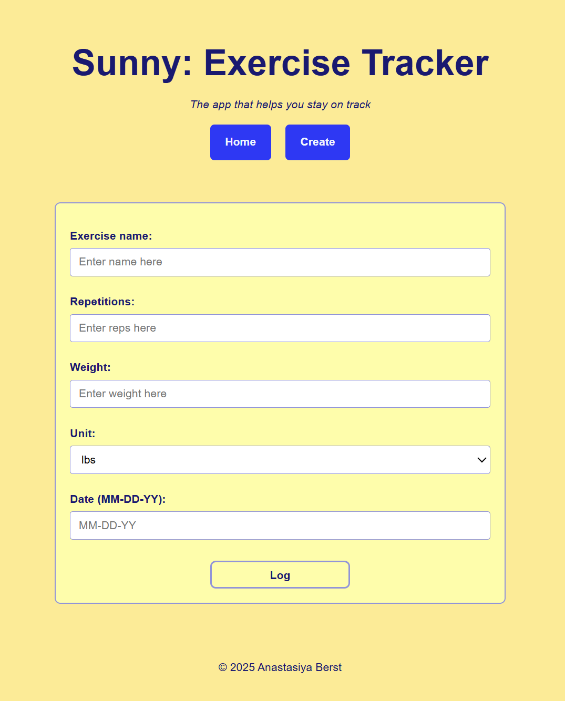
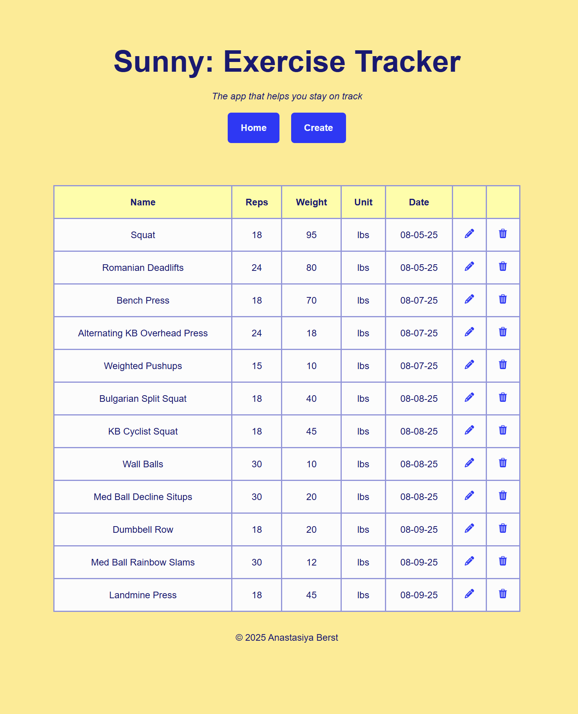

# :muscle: CS290 Exercise Tracker

Final project for `CS290: Web Development` at Oregon State University. It has been approved for public sharing.

This full-stack MERN app allows users to track their gym workouts by logging exercises with name, reps, weight, unit, and date.

   

:sunny: Coming soon!
